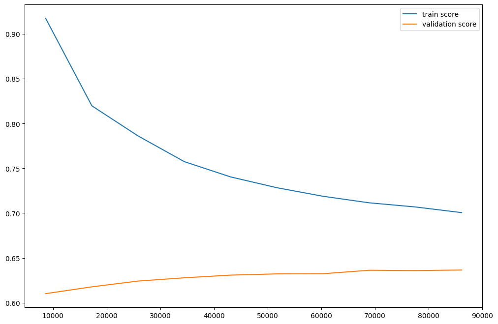

# Bank Churn Prediction

This project is part of the Machine Learnia ML-PRO training.  
The goal is to predict whether a customer will leave the bank (churn) based on historical customer data.  
It is a Kaggle competition, and this repository contains my experiments, notebooks, and results.

## Installation

This project uses [pyenv](https://github.com/pyenv/pyenv) for Python version management and [Poetry](https://python-poetry.org/) for dependency management.

### 1. Install dependencies with Poetry
```bash
poetry install
```

# Exploratory Data Analysis

•   Customer ID : Un identifiant pour chaque client
•   Surname : Le nom de famille du client
•   Credit Score : Une valeur numérique représentant le score de crédit du client
•   Geography : Le pays où réside le client (France, Spain ou Germany)
•   Gender : Le genre du client (Male or Female)
•   Age : L’âge du client
•   Tenure : Le nombre d’années pendant lesquelles le client est avec la banque
•   Balance : Le solde du compte du client
•   NumOfProducts : Le nombre de produits bancaires utilisés par le client (par exemple, compte d’épargne, carte de crédit)
•   HasCrCard : Si le client possède une carte de crédit (1 = oui, 0 = non)
•   IsActiveMember : Si le client est un membre actif (1 = oui, 0 = non)
•   EstimatedSalary : Le salaire estimé du client
•   Exited : Si le client a résilié (1 = oui, 0 = non)

## Checklist de base
### Analyse de Forme :
*   **variable target** : Exited
*   **lignes et colonnes** : 143579, 14
*   **types de variables** : 
    *   continues (6) : ID, CustomerId*, CreditScore, Age, Balance, EstimatedSalary
    *   discrètes (8): Surname, Geography, Gender, Tenure, NumOfProducts, HasCrCard, IsActiveMember, Exited
    *Colonne à supprimer car erreur dans le dataset (voir discord)
*   **Analyse des valeurs manquantes** : Aucune NaN
*   **Variables inutiles** : ID, CustomerId, Surname

### Analyse de Fond :
*   **Visualisation de la target** :
    -   21% de churn
*   **Signification des variables** :
    * Variables continues :
        - On distingue 2 groupes, Balance de compte à 0 et balance positive
    * Variables discrètes : 
        - Gender, HasCrCard, IsActiveMember, Exited sont binaires
        - La France représente plus de 50% du dataset
        - Il y a autant de membres actif que inactif
        - La proportion homme/femme semble équilibré
        - La grande majorité des clients ont 1 ou 2 produits
        - Les 3/4 des clients ont une carte de crédit
        - Moins de 1/4 des clients quittent la banque
        - La variable Tenure est bien répartit 
*   **Relation Variables / Target** :
    * Target / variables continues
        - L'âge semble être lié au churn, surtout apès 45 ans -> Hypothèse à tester
            - créé une colonne 'AgeGroup'
                - Le churn augmente de 45 à 55 ans et retombe après 60 ans
                    - 18–39 ans → churn faible (<15%).
                    - 40–44 ans → premier saut (~31%).
                    - 45–49 ans → énorme (~53%).
                    - 50–54 ans → encore plus haut (~64%).
                    - 55–59 ans → un peu moins (~55%).
                    - 60+ ans → retombe (~31%).
        - Balance = 0 (54% des clients, churn ~16%) vs Balance > 0 (46% des clients, churn ~27%) → Hypothèse à tester
            - créé une colonne 'HasBalance' binaire
    * Target / variables discrètes
        - La France et l'Espagne ont un taux de churn équivalent d'environ 17% (allemenagne -> 38 %) → Hypothèse à tester
            - créé 'IsGerman' binaire semble pertinente vu la ressemblance entre la France et l'Espagne
        - Les femmes churn plus que les hommes (28% vs 16%) → Hypothèse à tester
        - Les clients avec 2 produits sont très fidèles (6% de churn), avec 1 produit (34% de churn) et pour 3 et 4 produits (87% de churn)
            - créé 'NumProductsGroup' 1, 2 ou 3+
        - Les clients inactifs churn plus (30% vs 12%) → Hypothèse à tester

## **Conclusion EDA :**
Les principales variables explicatives du churn semblent être l’**âge** (surtout 45–55 ans), la **balance** (0 vs >0), la **géographie** (spécifiquement l’Allemagne), le **genre**, le **nombre de produits** et l’**activité du client**.
Certaines variables (CreditScore, Salary, Tenure) n’ont pas montré de relation claire avec la target.
Les insights obtenus motivent la création de **nouvelles features** (**AgeGroup**, **HasBalance**, **IsGerman**, **NumProductsGroup**) qui seront intégrées dans le pipeline de modélisation.

# Pre-processing

## Encoding

Les variables catégorielles "Gender", "Geography", "NumOfProducts" sont encodées avec la méthode de Target encoding qui consiste à remplacer leur valeurs par leur moyenne de churn (pour "Exited" = 1).

La variable "BalanceCat" est encodée simplement avec un Ordinal Encoder.

## Feature enineering

### "BalanceCat" :
Cette variable regroupe les clients selon la Balance de leur compte.
-   0                       : Nulle
- > 0 à  50000              : Faible
- > 50000 à 100000          : Moyen
- > 100000 à 150000         : Normals
- > 150000 à 200000         : Élevé
- > 200000 à MAX_Balance    : Très élevé

### ratio_salary_Age = EstimatedSalary / Age

### Active_x_Multi= (IsActiveMember == 1) & (NumOfProducts >= 2)

## Modèle

Le modèle XGBoostClassifier semble être le plus adapté des modèles que j'ai testé. En effet, je l'ai choisi car c'est lui qui généralise le meiux avec le moins d'overfitting et qui donne de meilleur résulatats.

## Evaluation
score f1 de 0.63

Matrice de confusion :

[[21315  1280]
 [ 2726  3395]]



## Optimisation avec RandomSearchCV

subsample : 0.8
reg_lambda : 9
reg_alpha : 0.6
n_estimator : 1040
min_child_weight : 2
max_depth : 5
max_delta_step : 2
learning_rate : 0.02
gamma : 1.2
colsample_bytree : 1
k_best : all
tgt__m : 10

threshold : 0.34237288135593225
F1: 0.6819344524380495

## Résutats

Entraînement sur tout le dataset avec un score f1 de 0.6783317353787153
Public score : 0.66544